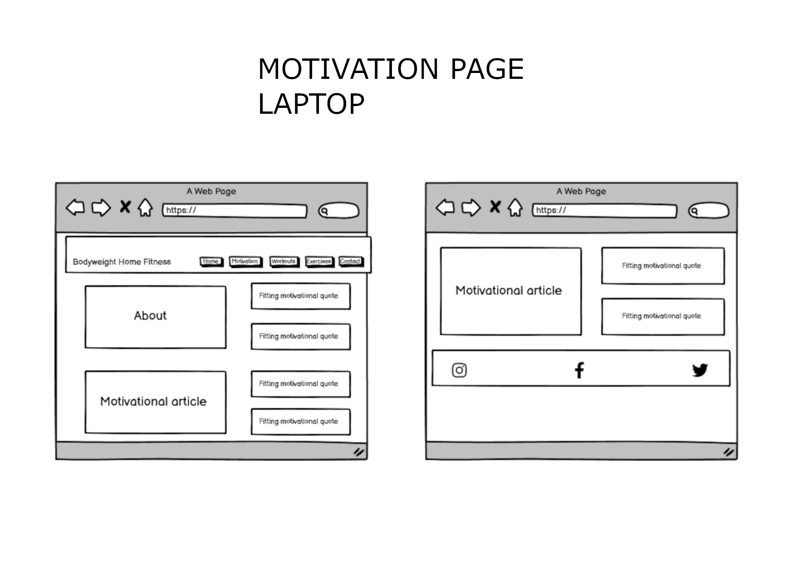
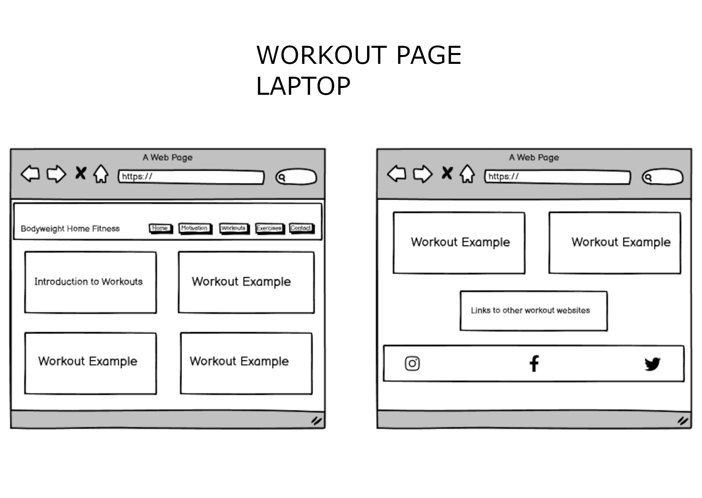
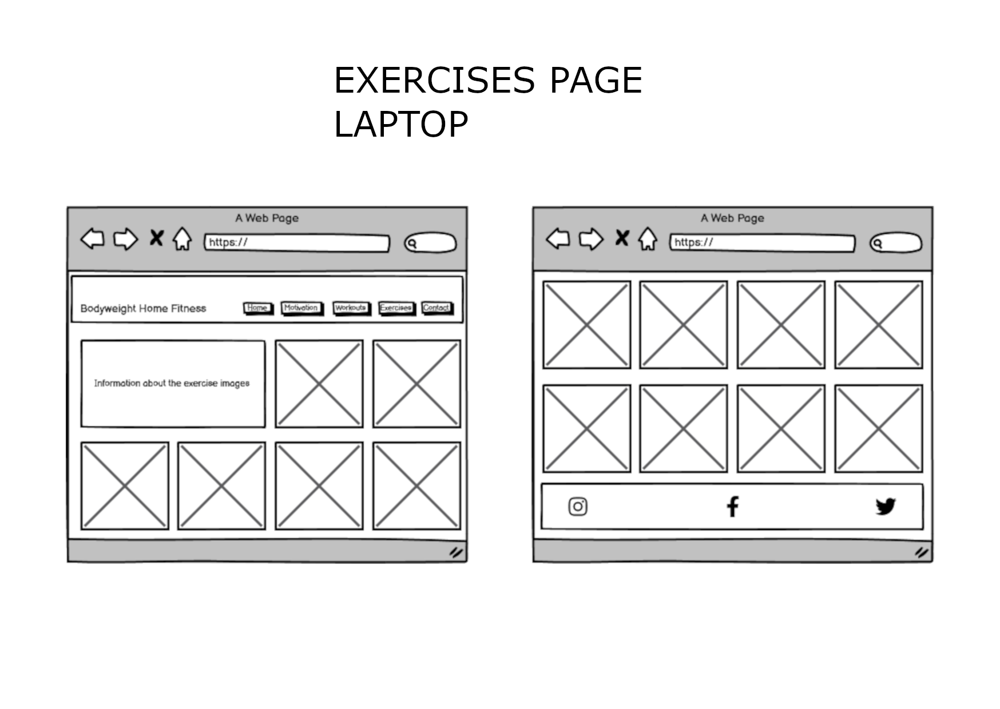

# **Bodyweight Home Fitness**
## **Introduction**
Bodyweight Home Fitness is a site that provides motivation for people to exercise at home. Giving both exercise and workout examples to help people achive their finess goal.

## **UX**

### Whos the site for?
* This site is primarily for people who struggle making time for exercise. 
* Its for people with a range of exercise experience but one of the main goals of the site is to make sure its accessible for begginers.
* Its for people looking to workout at home with no gym equipment needed using just your own body.

### Considerations for the culture of audience
This site is meant to be accessible to a wide audience looking for motivation and also for begginers to fitness. This means that both the design and content is not too overwhelming. The site structure is simple and easy to navigate with an inviting design.
One of the main messages in this website is that any amount of exercise is better than none so big complex workout and exercise examples are not needed so again simple minimal content is used throughout the site.

### User stories
* As a user I want to get motivated to exercise at home.
* As a user I want simple examples of how I can work on my fitness goals.
* As a user I want to share my experience and workouts.
* As a user I do not want to get overwhelmed with too much technical information and to be scared off by intimidating bodybuiling style workouts.
* As a user I want the site to be straighforward to navigate.
* As a user I would like to find links to other helpful websites to continue my fitness journey.
* As the site owner I want to provide motivation for people.
* As the site owner I want to provide simple home workouts to help people with their fitness goals.
* As the site owner I want people to send me new workouts to try.
* As the site owner I want to increase my socail media followers.
* As the site owner I want to promote working out at home instead of the gym.

#### For 1st time users
* Looking for motivation.
* Looking for exercise and workout examples.

#### For returning users
* looking to connect with social media links.
* Looking to remotivate themselves.
* To remind themselves of the exercise and workout examples.
* To share their own workout or message.

### How will this be achieved
* Straight forward inviting home page with clear navigation to topics.
* Motivational quotes and short consise articles so not to overwhelm the casual user.
* Simple  home exercise guide that is accessible to everyone, with easy to digest images and a detailed 'alt' for people needing screen readers.
* Examples of  home workouts with a message to re-state that even doing just a little is better than none so they aren't intimidated.
* Contact form for them to sugest a workout of send a message.
* Social media links to increase followers and provide user more motivation.
* Provide links to other websites for user to continue on their fitness journey.

## **Wireframes**

Wireframes were made with Balsamiq for Mobile, Tablet and Laptop devices.

## **Color Scheme and Typography**

In fitting in with my considerations for the culture of my audience I looked for a color scheme that would be simple but not boring and something that would not overwhelm. I found my color scheme on [canva.com](https://www.canva.com/learn/website-color-schemes/). 
To meet WCAG 2.0 criteria, the color scheme was then passed to [eightshapes.com](http://www.eightshapes.com) to generate an accessibility table.

