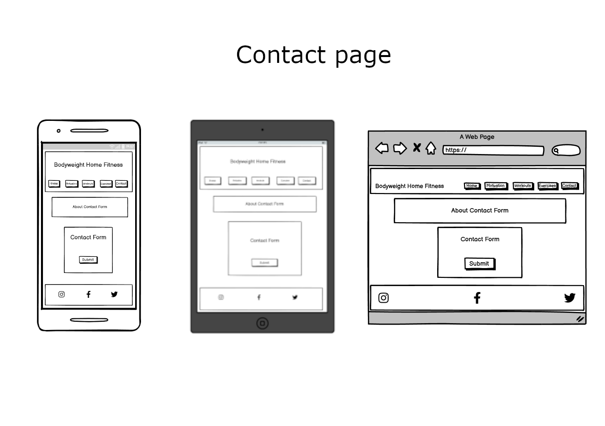

# **Bodyweight Home Fitness**
## **Introduction**

Bodyweight Home Fitness is a site that provides motivation for people to exercise at home. Giving both exercise and workout examples to help people achive their finess goal.

## **UX**

### Who is the website for?

* This site is primarily for people who struggle making time for exercise. 
* For people with a range of exercise experience and must be begginer friendly.
* For people looking to workout at home with no gym equipment using just your own body.

### Considerations for the culture of audience

This site is to be accessible to a wide audience looking for motivation including begginers. This means that both the design and content must not be overwhelming. The site structure is simple and easy to navigate with an inviting design.
One of the main messages in this website is that any amount of exercise is better than none, so big complex workout and exercise examples are not needed, so again simple minimal content is used throughout the site.

### User stories

* As a user I want to get motivated to exercise at home.
* As a user I want simple examples of how I can work towards my fitness goals.
* As a user I want to share my experience and workouts.
* As a user I do not want to get overwhelmed with too much technical information and to be scared off by intimidating bodybuiling style workouts.
* As a user I want the site to be straighforward to navigate.
* As a user I would like to find links to other helpful websites to continue my fitness journey.
* As the site owner I want to provide motivation for people.
* As the site owner I want to provide simple home workouts to help people with their fitness goals.
* As the site owner I want people to send in new workouts to try.
* As the site owner I want to promote my social media accounts.
* As the site owner I want to promote working out at home instead of the gym.

#### For first time users

* Looking for motivation.
* Looking for exercise and workout examples.

#### For returning users

* looking to connect with social media links.
* Looking to remotivate themselves.
* To remind themselves of the exercise and workout examples.
* To share their own workout or message.

### How will this be achieved

* Straight forward inviting home page with clear navigation to topics.
* Motivational quotes and short consise articles so not to overwhelm the casual user.
* Simple  home exercise guides that are accessible to everyone, with easy to digest images and a detailed 'alt' for people needing screen readers.
* Examples of  home workouts with a message to reiterate that even doing just a little is better than none so they are not intimidated.
* Contact form for them to suggest a workout or send a message.
* Social media links to increase followers and provide user more motivation.
* Provide links to other websites for user to continue on their fitness journey.

## **Imagery** ##

The images were carefully chosen to match the breif of the website, they are not distinctive yet not overwhelming. The images in the 'home page' and 'contact response page' are subtle in colour but are in keeping with the culture of the audience. The exercise example images are again simple but easy to digest. 

## **Wireframes**

Wireframes were made with Balsamiq for Mobile, Tablet and Desktop devices.

## **Color Scheme and Typography**

In keeping with my considerations for the culture of my audience I looked for a color scheme that would be simple but not dull and something that would not overwhelm. I found my color scheme on [canva.com](https://www.canva.com/learn/website-color-schemes/). 
To meet WCAG 2.0 criteria, the color scheme was then passed to [eightshapes.com](http://www.eightshapes.com) to generate an accessibility table.

Again, I wanted to use simple yet exciting typography which is easy to read. I found my fonts on [sliderrevolution.com](https://www.sliderrevolution.com/design/font-combinations/).

# **Features**

## **Header and Nav bar**

* The title of Bodyweight Home Fitness is clear, simple and stylish. It is responsive to all devices and  it acts as a link to the 'home page'. It has a subtle blinking boarder to gain attention.

* The Nav bar is present on all pages of the website and is very clear to see allowing for easy navigation. The active page is highlighted and a hover effect is also used to enhance ux.

## **Footer**

* The footer is large, visible and responsive to all devices. I have included a hover toggle to the links to improve UX. These icons were imported from font awesome using Javascript at the bottom of the page.

## **Anchor tags**

 * I wanted to keep the tags in keeping with the websites minimal style but visible for users so the default style was removed and the link is highlighed by bold font. The only exception to this was in the 'contact response page' where the social medial links needed an underline text decoration to help with highlighting the link.
 * External links are provided throughout the website for every article and workout example, opening in new tabs and with aria-lables. I have also included internal links to help with simple navigation.

 ## **Home Page**

 

 * I opted for a subtle but stylish home page so not to overwhelm and provide intrigue for the user, with a artistic image and 3 motivaional quotes.
 * With the easy to access nav bar it helps the user quickly click onto a subject they are inertested in and provide a great start to the websites journey.

 ## **Motivation Page**

 

* The motivation page has a section that states the goals for the webisite, hoping to motivate and help continue the users fitness journey.
* There are three short articles to read. They were chosen because they are concise, motivational and intended for a wide audience.
* These articles are broken up by motivatonal quotes to inspire the user.
* Initially I intended to add background images to the quotes but it did not work stylistically.
* Each article has a link to the source and each quote has  it's source named.
* CSS grid was used to change layout at 600px breakpoint to ensure good UX.

## **Workouts Page**

* The workout page has an introduction to encourage users and 5 workout examples.
* The workout examples are refernced with a link to the site that created it.
* Re-assuring messages are placed throughout the workouts to promote the common themes of the website.
* Links to other helpful sites are provided for users to continue their fitness journey.
* This page is fully responsive and changes css layout using flex at 768px devices. Initially I felt 1024px would be the breakpoint, but after early viewing this had to be changed.

## **Exercise Page**

* This exercise example page has an introduction  and images of how to do 18 home exercise.
* In keeping with the websites goal, these exercise guides are as accessible and simple as can be with straight-forward images on how to complete each exercise so not to overwhelm. These images have a detailed 'alt' description for people who use screen readers.
* This exercise image gallery is fully responsive, changing layout at different screen breakpoints to ensure good UX. 

## **Contact Page**

* Straight forward contact form with an introductory message asking for workout examples or just a general message.
* The message or suggested workout text area is a required field whereas the name is not.
* A 'get' method was used instead of 'post' in order to get a simulated contact response when the form is subbmitted.

## **Contact Response Page**

* This page provides a thank you message to users who submit the contact form.
* There are two images under the thank you message which match the style of the website.

# **Future Enhancements**

* To add more exercises to exercise page.
* To add more workouts to workouts page. It would be great to put in users workouts and user stories on how they motivate themselves. 
* If more content is added I would add in different images and quotes to break up the text sections to enhance user experience. My mentor sent me a some information about [Gestalt principles in UI design](https://medium.muz.li/gestalt-principles-in-ui-design-6b75a41e9965) which I would use in future modifications of this website.

# **Testing**

## **Manual Testing**

* I tested my website on mobile phones, tablets and desktops to make sure it was responsive, worked  and looked good on all devise sizes.
* It was tested on google chrome, microsoft edge and safari browsers to ensure it works on all.
* I tested throughout the project using dev tools in google, testing responsiveness at all sizes from 320px width to desktop.
* After the project was complete I made a check list to test all links, buttons and hover effects to make sure every element worked on each page. I double checked that all external links had aria-labels and opened in a new tab and the images had alt messages.

## **Code Validators**

All 6 pages were run through a HTML validator at [https://validator.w3.org/nu/](https://validator.w3.org/nu/) and passed.

The CSS also passed the validator testing at [https://jigsaw.w3.org/css-validator/](https://jigsaw.w3.org/css-validator/).

## **Lighthouse**

After fixing a few bugs and making a couple of changes in my code as described in the 'Bugs' section, my lighthouse scores came back with good consistent results on all 6 pages as seen below. These are desktop scores. When I ran the tests for mobile the scores are also very good but slightly lower (95-99) on performance. One factor for this is the image size but I have already compressed the images as much as I can without losing quality.

# **Bugs**

* Following my manual testing I noticed four issues which I fixed.
    * The layout of the motivation and workout page did not visually work when following my initial planned wireframes. I changed the breakpoints so that tablets also shared the same layout as the desktop site.
    * The hero image looked different on my deployed page. Using dev tools and google I found out that the background-size cover value was not working because of the position I placed it in the css, so I moved it lower in the dom to fix the issue.
    * Both the contact page and contact response pages did not fill the pages on some mobiles and tablets so I increased the size of the content and added spacing to fix issue.

* Following the HTML validator testing I made three changes to make sure it passed. 
    * I needed to add a 'p' element in the motivation page which I previously missed.
    * In the exercise page I changed a 'section' element to a 'div' as the section didnt have a heading.
    * In the contact response page I changed a 'section' element to a 'div' as the section did not have a heading.

* Following Lighthouse tests it suggested three changes to incease my lighthouse best practice score to 100 on all 6 pages.
    * The nav bar buttons should be larger. So I incesased their size to fix issue.
    * My list structure on my links section needed improvement. So I deleted the 'br' attributes and added padding instead which fixed the issue.
    * Another suggestion was to add a better link description for my link to a youtube workout video. So I improved the description link.

* My lighthouse performance scores initally were a bit lower and flagged up a couple of things I could change.
    * It was sugested to compress image sizes. I did this on [https://tinypng.com/](https://tinypng.com/) to all of my images but the lighthouse suggestion still flagged up so I converted them to webp files using [https://www.birme.net/?auto_width=true&image_format=webp](https://www.birme.net/?auto_width=true&image_format=webp). This improved my scores.
    * My images did not have implicit widths and heights which also affected the performance score so I added into the html the width and height of each image. This fixed the issue.
    * It was also suggested that I minimised the css. I cleaned the css up to make it more efficient.

* My mentor noticed the following issues.
    * That the buttons on the nav bar and form changed in size upon hover. This was a style choice by me but it was pointed out that this was not best practice so I ammended the hover style rules to fix the issue.
    * The text using the teko font family appeared to flash upon reloading the pages. This is a common issue called 'fouc' where the browsers default font styles are shown prior to loading the google font url. I changed the font display attribute to block to give the font face a short block period so this 'flashing' is less likely to occur.

# **Deployment**

Github Pages was used to deploy the website by the following steps:

* I went to Github.
* Selected my repository for this project.
* Clicked on the Settings link.
* Clicked on the Pages link in the left hand side navigation bar.
* In the Source section, I chose main from the drop down select branch menu and selected Root from the drop down select folder menu.
* Clicked save, and the live Github Pages site was deployed at [https://daviddock.github.io/bodyweight-home-fitness/index.html](https://daviddock.github.io/bodyweight-home-fitness/index.html)

# **Credits**

## **Technologies Used**

HTML and CSS were used to build the website.

### **Learning**

* The majority of my learning was through Code Insitute.
* Code Institutes Love Running walkthrough project taught me how to create and deploy a project through Git pod and Git hub.

### **New learning**

* I learned both css grid and flex display types through [Kevin Powell](https://www.youtube.com/@KevinPowell) youtube videos as per suggestion by our slack tutors.
* CSS box shadow, gradient and footer toggle shake animation were learned and modified from [https://www.w3schools.com/howto/howto_css_shake_image.asp](https://www.w3schools.com/howto/howto_css_shake_image.asp).
* The blinking boarder around my logo was learnt from [https://stackoverflow.com/questions/51764992/blink-border-3-times-1-second-per-loop-in-css](https://stackoverflow.com/questions/51764992/blink-border-3-times-1-second-per-loop-in-css).

## **Content and Media**

* The fonts are sourced from google fonts.
* The icons are sourced from font awesome.
* The image of my website in different devices is from [ui.dev/amiresponsive](ui.dev/amiresponsive).
* The articles in the motivation page were taken from the free newsletter [The Pump Daily](https://schwarzenegger.ck.page/0943ca5e13). These were credited in the website.
* Motivational quotes by various people, credited in the website.
* Workout examples are credited in the workout page and were taken from The Pump daily, Crossfit, Thenx and Fitnessvolt.
* The hero image on the home page and the two images in the contact response page were taken from vecteezy.com and modifiyed by me to match the websites style. These images do not need attribution.
* The exercise images were also taken from vecteezy.com.

